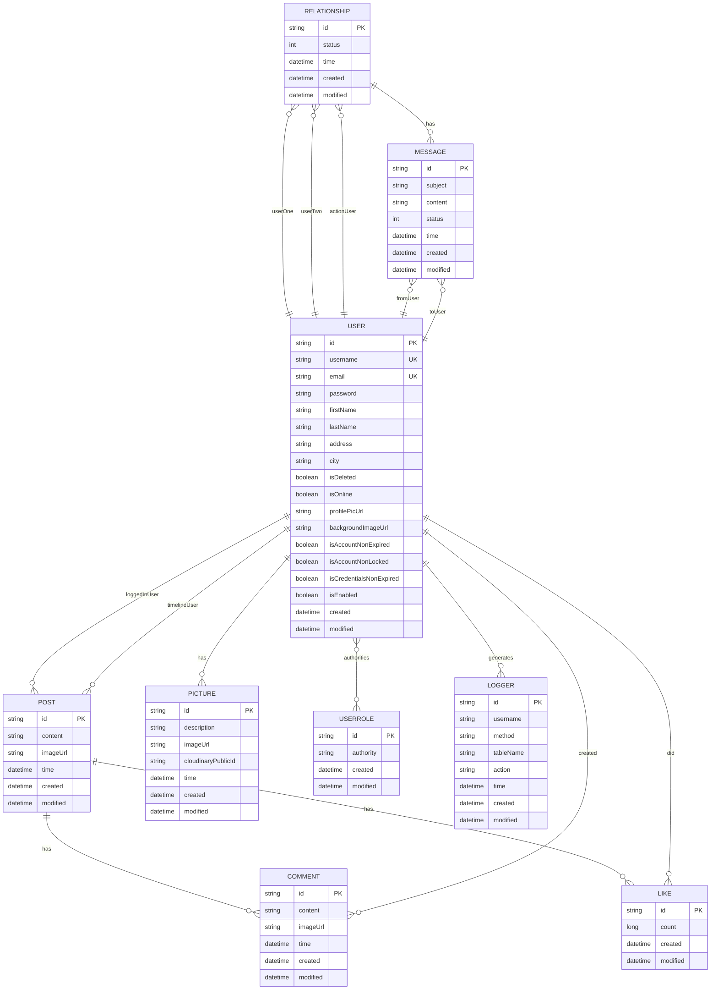

# Alumni Networking Platform - Complete Documentation

## Table of Contents
1. [Project Overview](#project-overview)
2. [Architecture](#architecture)
3. [Database Schema](#database-schema)
4. [API Endpoints](#api-endpoints)
5. [Authentication & Security](#authentication--security)
6. [Real-Time Features](#real-time-features)
7. [File Management](#file-management)
8. [Logging System](#logging-system)
9. [Error Handling](#error-handling)
10. [Configuration](#configuration)
11. [Testing](#testing)
12. [Deployment](#deployment)

---

## Project Overview

### Purpose
The Alumni Networking Platform is a comprehensive social networking application designed specifically for alumni communities. It provides features similar to Facebook/LinkedIn but tailored for educational institutions' alumni networks.

### Key Features
- **User Management**: Registration, authentication, profile management
- **Social Networking**: Friend relationships, friend requests, user search
- **Content Sharing**: Posts, comments, likes, image sharing
- **Real-Time Communication**: WebSocket-based messaging and online status
- **File Management**: Cloud-based image storage via Cloudinary
- **Role-Based Access Control**: ROOT, ADMIN, USER roles with different permissions
- **Comprehensive Logging**: Audit trails for all user actions
- **RESTful API**: Stateless HTTP endpoints for frontend integration

### Technology Stack
- **Backend**: Spring Boot 2.1.3, Java 11
- **Database**: MySQL 8.3.0, H2 (testing)
- **Security**: Spring Security, JWT tokens
- **File Storage**: Cloudinary cloud service
- **Real-Time**: WebSocket with STOMP
- **Build Tool**: Maven
- **Testing**: JUnit, Mockito

---

## Architecture

### High-Level Architecture
```
┌─────────────────┐    ┌─────────────────┐    ┌─────────────────┐
│   Client Layer  │    │  Presentation   │    │   Business      │
│                 │    │     Layer       │    │     Layer       │
│ Web Browser     │◄──►│   Controllers   │◄──►│    Services     │
│ Mobile App      │    │   WebSocket     │    │   Validation    │
└─────────────────┘    └─────────────────┘    └─────────────────┘
                                │                       │
                                ▼                       ▼
                       ┌─────────────────┐    ┌─────────────────┐
                       │   Security      │    │   Persistence   │
                       │     Layer       │    │     Layer       │
                       │ JWT Filters     │    │  Repositories   │
                       │ Authorization   │    │   JPA/Hibernate │
                       └─────────────────┘    └─────────────────┘
                                                        │
                                                        ▼
                                               ┌─────────────────┐
                                               │   Database      │
                                               │     Layer       │
                                               │     MySQL       │
                                               │      H2         │
                                               └─────────────────┘
```

### Design Patterns
- **MVC Pattern**: Clear separation between Model, View (API responses), and Controllers
- **Repository Pattern**: Data access abstraction
- **Service Layer Pattern**: Business logic encapsulation
- **DTO Pattern**: Data transfer objects for API communication
- **Interceptor Pattern**: Request logging and monitoring
- **Filter Pattern**: Security and authentication

---

## Database Schema

### Entity Relationships



### Database Tables

#### 1. users
```sql
CREATE TABLE users (
    id VARCHAR(255) PRIMARY KEY,
    username VARCHAR(50) UNIQUE NOT NULL,
    email VARCHAR(50) UNIQUE NOT NULL,
    password VARCHAR(255) NOT NULL,
    first_name VARCHAR(255) NOT NULL,
    last_name VARCHAR(255) NOT NULL,
    address VARCHAR(255) NOT NULL,
    city VARCHAR(255) NOT NULL,
    is_deleted BOOLEAN DEFAULT FALSE,
    is_online BOOLEAN DEFAULT FALSE,
    profile_pic_url TEXT,
    background_image_url TEXT,
    is_account_non_expired BOOLEAN DEFAULT TRUE,
    is_account_non_locked BOOLEAN DEFAULT TRUE,
    is_credentials_non_expired BOOLEAN DEFAULT TRUE,
    is_enabled BOOLEAN DEFAULT TRUE,
    created DATETIME,
    modified DATETIME
);
```

#### 2. roles
```sql
CREATE TABLE roles (
    id VARCHAR(255) PRIMARY KEY,
    authority VARCHAR(255) NOT NULL,
    created DATETIME,
    modified DATETIME
);
```

#### 3. users_roles (Many-to-Many)
```sql
CREATE TABLE users_roles (
    user_id VARCHAR(255),
    role_id VARCHAR(255),
    PRIMARY KEY (user_id, role_id),
    FOREIGN KEY (user_id) REFERENCES users(id),
    FOREIGN KEY (role_id) REFERENCES roles(id)
);
```

#### 4. posts
```sql
CREATE TABLE posts (
    id VARCHAR(255) PRIMARY KEY,
    user_id VARCHAR(255) NOT NULL,
    timeline_user_id VARCHAR(255) NOT NULL,
    content TEXT NOT NULL,
    image_url VARCHAR(255),
    time DATETIME NOT NULL,
    created DATETIME,
    modified DATETIME,
    FOREIGN KEY (user_id) REFERENCES users(id),
    FOREIGN KEY (timeline_user_id) REFERENCES users(id)
);
```

#### 5. comments
```sql
CREATE TABLE comments (
    id VARCHAR(255) PRIMARY KEY,
    post_id VARCHAR(255) NOT NULL,
    creator_id VARCHAR(255) NOT NULL,
    timeline_user_id VARCHAR(255) NOT NULL,
    content TEXT NOT NULL,
    image_url VARCHAR(255),
    time DATETIME NOT NULL,
    created DATETIME,
    modified DATETIME,
    FOREIGN KEY (post_id) REFERENCES posts(id),
    FOREIGN KEY (creator_id) REFERENCES users(id),
    FOREIGN KEY (timeline_user_id) REFERENCES users(id)
);
```

#### 6. likes
```sql
CREATE TABLE likes (
    id VARCHAR(255) PRIMARY KEY,
    user_id VARCHAR(255),
    post_id VARCHAR(255),
    count BIGINT DEFAULT 0,
    created DATETIME,
    modified DATETIME,
    FOREIGN KEY (user_id) REFERENCES users(id),
    FOREIGN KEY (post_id) REFERENCES posts(id)
);
```

#### 7. pictures
```sql
CREATE TABLE pictures (
    id VARCHAR(255) PRIMARY KEY,
    user_id VARCHAR(255) NOT NULL,
    description VARCHAR(255),
    image_url VARCHAR(255) NOT NULL,
    cloudinary_public_id VARCHAR(255),
    time DATETIME NOT NULL,
    created DATETIME,
    modified DATETIME,
    FOREIGN KEY (user_id) REFERENCES users(id)
);
```

#### 8. relationship
```sql
CREATE TABLE relationship (
    id VARCHAR(255) PRIMARY KEY,
    user_one_id VARCHAR(255) NOT NULL,
    user_two_id VARCHAR(255) NOT NULL,
    action_user_id VARCHAR(255) NOT NULL,
    status TINYINT DEFAULT 0,
    time DATETIME NOT NULL,
    created DATETIME,
    modified DATETIME,
    FOREIGN KEY (user_one_id) REFERENCES users(id),
    FOREIGN KEY (user_two_id) REFERENCES users(id),
    FOREIGN KEY (action_user_id) REFERENCES users(id)
);
```

#### 9. messages
```sql
CREATE TABLE messages (
    id VARCHAR(255) PRIMARY KEY,
    from_user_id VARCHAR(255) NOT NULL,
    to_user_id VARCHAR(255) NOT NULL,
    relationship_id VARCHAR(255) NOT NULL,
    subject VARCHAR(255),
    content TEXT NOT NULL,
    status TINYINT DEFAULT 0,
    time DATETIME NOT NULL,
    created DATETIME,
    modified DATETIME,
    FOREIGN KEY (from_user_id) REFERENCES users(id),
    FOREIGN KEY (to_user_id) REFERENCES users(id),
    FOREIGN KEY (relationship_id) REFERENCES relationship(id)
);
```

#### 10. logs
```sql
CREATE TABLE logs (
    id VARCHAR(255) PRIMARY KEY,
    username VARCHAR(255),
    method VARCHAR(10),
    table_name VARCHAR(255),
    action VARCHAR(255),
    time DATETIME,
    created DATETIME,
    modified DATETIME
);
```

---

## API Endpoints

### Authentication Endpoints

#### 1. User Registration
```
POST /users/register
Content-Type: application/json

Request Body:
{
    "username": "string",
    "email": "string",
    "password": "string",
    "confirmPassword": "string",
    "firstName": "string",
    "lastName": "string",
    "address": "string",
    "city": "string"
}

Response: 200 OK
{
    "timestamp": "2024-01-01T12:00:00",
    "message": "User registered successfully",
    "payload": {
        "id": "string",
        "username": "string",
        "email": "string"
    },
    "success": true
}
```

#### 2. User Login
```
POST /login
Content-Type: application/json

Request Body:
{
    "username": "string",
    "password": "string"
}

Response: 200 OK
Authorization: Bearer <JWT_TOKEN>
```

### User Management Endpoints

#### 3. Get All Users (Admin/Root Only)
```
GET /users/all/{userId}
Authorization: Bearer <JWT_TOKEN>

Response: 200 OK
[
    {
        "id": "string",
        "username": "string",
        "firstName": "string",
        "lastName": "string",
        "role": "string"
    }
]
```

#### 4. Get User Details
```
GET /users/details/{id}
Authorization: Bearer <JWT_TOKEN>

Response: 200 OK
{
    "id": "string",
    "username": "string",
    "firstName": "string",
    "lastName": "string",
    "email": "string",
    "address": "string",
    "city": "string",
    "profilePicUrl": "string",
    "backgroundImageUrl": "string",
    "isOnline": boolean
}
```

#### 5. Update User Profile
```
PUT /users/update/{id}
Authorization: Bearer <JWT_TOKEN>
Content-Type: application/json

Request Body:
{
    "firstName": "string",
    "lastName": "string",
    "address": "string",
    "city": "string"
}

Response: 200 OK
{
    "timestamp": "2024-01-01T12:00:00",
    "message": "Profile updated successfully",
    "payload": "",
    "success": true
}
```

#### 6. Delete User (Root Only)
```
DELETE /users/delete/{id}
Authorization: Bearer <JWT_TOKEN>

Response: 200 OK
{
    "timestamp": "2024-01-01T12:00:00",
    "message": "User deleted successfully",
    "payload": "",
    "success": true
}
```

#### 7. Promote User (Admin/Root Only)
```
POST /users/promote?id={userId}
Authorization: Bearer <JWT_TOKEN>

Response: 200 OK
{
    "timestamp": "2024-01-01T12:00:00",
    "message": "User promoted successfully",
    "payload": "",
    "success": true
}
```

#### 8. Demote User (Admin/Root Only)
```
POST /users/demote?id={userId}
Authorization: Bearer <JWT_TOKEN>

Response: 200 OK
{
    "timestamp": "2024-01-01T12:00:00",
    "message": "User demoted successfully",
    "payload": "",
    "success": true
}
```

### Relationship Management Endpoints

#### 9. Get User Friends
```
GET /relationship/friends/{userId}
Authorization: Bearer <JWT_TOKEN>

Response: 200 OK
[
    {
        "id": "string",
        "username": "string",
        "firstName": "string",
        "lastName": "string",
        "profilePicUrl": "string",
        "isOnline": boolean
    }
]
```

#### 10. Find Potential Friends
```
GET /relationship/findFriends/{userId}
Authorization: Bearer <JWT_TOKEN>

Response: 200 OK
[
    {
        "id": "string",
        "username": "string",
        "firstName": "string",
        "lastName": "string",
        "profilePicUrl": "string"
    }
]
```

#### 11. Send Friend Request
```
POST /relationship/addFriend
Authorization: Bearer <JWT_TOKEN>
Content-Type: application/json

Request Body:
{
    "userOneId": "string",
    "userTwoId": "string",
    "actionUserId": "string"
}

Response: 200 OK
{
    "timestamp": "2024-01-01T12:00:00",
    "message": "Friend request sent successfully",
    "payload": "",
    "success": true
}
```

#### 12. Accept Friend Request
```
POST /relationship/acceptFriend
Authorization: Bearer <JWT_TOKEN>
Content-Type: application/json

Request Body:
{
    "userOneId": "string",
    "userTwoId": "string",
    "actionUserId": "string"
}

Response: 200 OK
{
    "timestamp": "2024-01-01T12:00:00",
    "message": "Friend request accepted",
    "payload": "",
    "success": true
}
```

#### 13. Remove Friend
```
POST /relationship/removeFriend
Authorization: Bearer <JWT_TOKEN>
Content-Type: application/json

Request Body:
{
    "userOneId": "string",
    "userTwoId": "string",
    "actionUserId": "string"
}

Response: 200 OK
{
    "timestamp": "2024-01-01T12:00:00",
    "message": "Friend removed successfully",
    "payload": "",
    "success": true
}
```

#### 14. Cancel Friend Request
```
POST /relationship/cancelRequest
Authorization: Bearer <JWT_TOKEN>
Content-Type: application/json

Request Body:
{
    "userOneId": "string",
    "userTwoId": "string",
    "actionUserId": "string"
}

Response: 200 OK
{
    "timestamp": "2024-01-01T12:00:00",
    "message": "Friend request cancelled",
    "payload": "",
    "success": true
}
```

#### 15. Search Users
```
GET /relationship/search?searchSymbols={searchTerm}
Authorization: Bearer <JWT_TOKEN>

Response: 200 OK
[
    {
        "id": "string",
        "username": "string",
        "firstName": "string",
        "lastName": "string",
        "profilePicUrl": "string"
    }
]
```

### Content Management Endpoints

#### 16. Create Post
```
POST /post/create
Authorization: Bearer <JWT_TOKEN>
Content-Type: application/json

Request Body:
{
    "loggedInUserId": "string",
    "timelineUserId": "string",
    "content": "string",
    "imageUrl": "string"
}

Response: 200 OK
{
    "timestamp": "2024-01-01T12:00:00",
    "message": "Post created successfully",
    "payload": "",
    "success": true
}
```

#### 17. Get User Posts
```
GET /post/all/{userId}
Authorization: Bearer <JWT_TOKEN>

Response: 200 OK
[
    {
        "id": "string",
        "content": "string",
        "imageUrl": "string",
        "time": "2024-01-01T12:00:00",
        "loggedInUser": {
            "id": "string",
            "username": "string",
            "firstName": "string",
            "lastName": "string"
        },
        "likeCount": 5,
        "commentCount": 3
    }
]
```

#### 18. Delete Post
```
DELETE /post/remove
Authorization: Bearer <JWT_TOKEN>
Content-Type: application/json

Request Body:
{
    "postId": "string",
    "loggedInUserId": "string"
}

Response: 200 OK
{
    "timestamp": "2024-01-01T12:00:00",
    "message": "Post deleted successfully",
    "payload": "",
    "success": true
}
```

#### 19. Add Like
```
POST /like/add
Authorization: Bearer <JWT_TOKEN>
Content-Type: application/json

Request Body:
{
    "postId": "string",
    "userId": "string"
}

Response: 200 OK
{
    "timestamp": "2024-01-01T12:00:00",
    "message": "Like added successfully",
    "payload": "",
    "success": true
}
```

#### 20. Create Comment
```
POST /comment/create
Authorization: Bearer <JWT_TOKEN>
Content-Type: application/json

Request Body:
{
    "postId": "string",
    "creatorId": "string",
    "timelineUserId": "string",
    "content": "string",
    "imageUrl": "string"
}

Response: 200 OK
{
    "timestamp": "2024-01-01T12:00:00",
    "message": "Comment created successfully",
    "payload": "",
    "success": true
}
```

#### 21. Delete Comment
```
DELETE /comment/remove
Authorization: Bearer <JWT_TOKEN>
Content-Type: application/json

Request Body:
{
    "commentId": "string",
    "loggedInUserId": "string"
}

Response: 200 OK
{
    "timestamp": "2024-01-01T12:00:00",
    "message": "Comment deleted successfully",
    "payload": "",
    "success": true
}
```

### File Management Endpoints

#### 22. Upload Picture
```
POST /pictures/add
Authorization: Bearer <JWT_TOKEN>
Content-Type: multipart/form-data

Form Data:
- loggedInUserId: string
- file: MultipartFile

Response: 200 OK
{
    "timestamp": "2024-01-01T12:00:00",
    "message": "Picture uploaded successfully",
    "payload": "",
    "success": true
}
```

#### 23. Get User Pictures
```
GET /pictures/all/{userId}
Authorization: Bearer <JWT_TOKEN>

Response: 200 OK
[
    {
        "id": "string",
        "description": "string",
        "imageUrl": "string",
        "time": "2024-01-01T12:00:00"
    }
]
```

#### 24. Delete Picture
```
POST /pictures/remove
Authorization: Bearer <JWT_TOKEN>
Content-Type: application/json

Request Body:
{
    "loggedInUserId": "string",
    "photoToRemoveId": "string"
}

Response: 200 OK
{
    "timestamp": "2024-01-01T12:00:00",
    "message": "Picture deleted successfully",
    "payload": "",
    "success": true
}
```

### Messaging Endpoints

#### 25. Send Message
```
POST /message/create
Authorization: Bearer <JWT_TOKEN>
Content-Type: application/json

Request Body:
{
    "fromUserId": "string",
    "toUserId": "string",
    "relationshipId": "string",
    "subject": "string",
    "content": "string"
}

Response: 200 OK
{
    "timestamp": "2024-01-01T12:00:00",
    "message": "Message sent successfully",
    "payload": "",
    "success": true
}
```

#### 26. Get User Messages
```
GET /message/all/{userId}
Authorization: Bearer <JWT_TOKEN>

Response: 200 OK
[
    {
        "id": "string",
        "subject": "string",
        "content": "string",
        "time": "2024-01-01T12:00:00",
        "fromUser": {
            "id": "string",
            "username": "string",
            "firstName": "string",
            "lastName": "string"
        },
        "toUser": {
            "id": "string",
            "username": "string",
            "firstName": "string",
            "lastName": "string"
        }
    }
]
```

#### 27. Get Friend Messages
```
GET /message/friend?fromUserId={fromUserId}&toUserId={toUserId}
Authorization: Bearer <JWT_TOKEN>

Response: 200 OK
[
    {
        "id": "string",
        "subject": "string",
        "content": "string",
        "time": "2024-01-01T12:00:00",
        "fromUser": {
            "id": "string",
            "username": "string"
        },
        "toUser": {
            "id": "string",
            "username": "string"
        }
    }
]
```

### Logging Endpoints (Admin/Root Only)

#### 28. Get All Logs
```
GET /logs/all
Authorization: Bearer <JWT_TOKEN>

Response: 200 OK
[
    {
        "id": "string",
        "username": "string",
        "method": "string",
        "tableName": "string",
        "action": "string",
        "time": "01 Jan 2024 12:00:00"
    }
]
```

#### 29. Get Logs by Username
```
GET /logs/findByUserName/{username}
Authorization: Bearer <JWT_TOKEN>

Response: 200 OK
[
    {
        "id": "string",
        "username": "string",
        "method": "string",
        "tableName": "string",
        "action": "string",
        "time": "01 Jan 2024 12:00:00"
    }
]
```

#### 30. Clear All Logs (Root Only)
```
DELETE /logs/clear
Authorization: Bearer <JWT_TOKEN>

Response: 200 OK
{
    "timestamp": "2024-01-01T12:00:00",
    "message": "All logs deleted successfully",
    "payload": "",
    "success": true
}
```

#### 31. Clear User Logs (Root Only)
```
DELETE /logs/clearByName/{username}
Authorization: Bearer <JWT_TOKEN>

Response: 200 OK
{
    "timestamp": "2024-01-01T12:00:00",
    "message": "User logs deleted successfully",
    "payload": "",
    "success": true
}
```

---

## Authentication & Security

### JWT Token Structure
```json
{
    "sub": "username",
    "exp": 1234567890,
    "role": "USER|ADMIN|ROOT",
    "id": "user_id",
    "profilePicUrl": "string",
    "firstName": "string"
}
```

### Role-Based Access Control

#### ROOT Role
- Full system access
- Can delete users
- Can clear all logs
- Can manage all system operations

#### ADMIN Role
- Can view all users
- Can promote/demote users
- Can view all logs
- Cannot delete users or clear logs

#### USER Role
- Can manage own profile
- Can create posts, comments, likes
- Can manage friend relationships
- Can upload/manage pictures
- Can send/receive messages

### Security Configuration
- **CORS**: Configured for cross-origin requests
- **CSRF**: Disabled for API endpoints
- **Session Management**: Stateless (JWT-based)
- **Password Encryption**: BCrypt with salt
- **Token Expiration**: 14 days (1,200,000,000 milliseconds)

### Authentication Flow
1. Client sends credentials to `/login`
2. Server validates credentials
3. JWT token generated with user claims
4. Token returned in Authorization header
5. Subsequent requests include token in header
6. Server validates token and extracts user context

---

## Real-Time Features

### WebSocket Configuration
- **Protocol**: STOMP over WebSocket
- **Authentication**: JWT token-based
- **Event Types**: CONNECT, DISCONNECT
- **Destinations**: `/topic/connect`, `/topic/disconnect`

### Online Status Management
```java
// User connects
WebSocketEventListener.handleSessionConnected()
→ UserService.updateUserOnlineStatus(username, true)
→ Broadcast CONNECT event to all clients

// User disconnects
WebSocketEventListener.handleSessionDisconnect()
→ UserService.updateUserOnlineStatus(username, false)
→ Broadcast DISCONNECT event to all clients
```

### WebSocket Message Format
```json
{
    "eventName": "CONNECT|DISCONNECT",
    "userId": "string",
    "username": "string",
    "isOnline": boolean
}
```

### Real-Time Features
- **User Online/Offline Status**: Real-time updates
- **Friend Status**: Live friend online indicators
- **Event Broadcasting**: System-wide notifications
- **Connection Management**: Automatic cleanup

---

## File Management

### Cloudinary Integration
- **Cloud Service**: Cloudinary for image storage
- **File Types**: Images (JPG, PNG, GIF, etc.)
- **Size Limits**: 200MB per file
- **Storage**: Cloud-based with CDN delivery
- **Security**: Public ID management for access control

### Upload Process
1. Client sends multipart file
2. Server validates file type and size
3. Temporary file created
4. Cloudinary upload with unique public ID
5. Database record created with Cloudinary URL
6. Temporary file cleaned up

### File Operations
- **Upload**: Direct to Cloudinary with metadata
- **Delete**: Remove from Cloudinary and database
- **Retrieval**: Cloudinary URLs for fast delivery
- **Management**: Public ID tracking for cleanup

### Configuration
```properties
cloudinary.cloud_name=dzoifjf1o
cloudinary.api_key=111741512349367
cloudinary.api_secret=b4VlBChJydUexK-hbgxE9Fy1rpI
```

---

## Logging System

### Log Structure
```java
public class Logger {
    private String id;
    private String username;      // User who performed action
    private String method;        // HTTP method (POST/PUT/DELETE)
    private String tableName;     // Target resource
    private String action;        // Specific action
    private LocalDateTime time;   // When action occurred
}
```

### Logging Types

#### Automatic Logging (Interceptor)
- **Trigger**: All POST, PUT, DELETE requests
- **Filter**: Excludes error endpoints
- **Data**: Method, user, resource, action, timestamp

#### Manual Logging (Service Level)
- **User Registration**: `createLog("POST", username, "users", "register")`
- **User Login**: `createLog("POST", username, "-", "login")`
- **Custom Events**: Service methods can log specific actions

### Log Management
- **View All**: Admin/Root access to all logs
- **Filter by User**: Search logs by username
- **Delete All**: Root-only bulk deletion
- **Delete by User**: Root-only user-specific deletion
- **Scheduled Cleanup**: Configurable automatic cleanup

### Log Security
- **Access Control**: Role-based log viewing
- **Data Protection**: Sensitive data filtering
- **Audit Trail**: Complete action history
- **Compliance**: GDPR-ready logging practices

---

## Error Handling

### Exception Types

#### CustomException (500 Internal Server Error)
```java
@ResponseStatus(HttpStatus.INTERNAL_SERVER_ERROR)
public class CustomException extends RuntimeException {
    // Service-level failures
    // Database operation failures
    // External API failures
}
```

#### BadRequestException (400 Bad Request)
```java
@ResponseStatus(HttpStatus.BAD_REQUEST)
public class BadRequestException extends RuntimeException {
    // Validation failures
    // Invalid input data
    // Business rule violations
}
```

#### UsernameNotFoundException (401 Unauthorized)
```java
// Authentication failures
// Invalid credentials
// User not found
```

### Error Response Format
```json
{
    "timestamp": "2024-01-01T12:00:00",
    "message": "Error description",
    "payload": "",
    "success": false
}
```

### Validation Errors
- **Bean Validation**: @NotNull, @Size, @Pattern
- **Custom Validation**: @Password, @UniqueEmail, @UniqueUsername
- **Business Validation**: Service-level rule checking
- **Input Sanitization**: XSS and injection prevention

### Error Handling Strategy
1. **Input Validation**: Bean validation with custom annotations
2. **Business Validation**: Service-level rule enforcement
3. **Exception Handling**: Global exception handlers
4. **Error Logging**: Comprehensive error tracking
5. **User Feedback**: Clear error messages

---

## Configuration

### Application Properties
```properties
# Database Configuration
spring.datasource.driverClassName=com.mysql.cj.jdbc.Driver
spring.datasource.url=jdbc:mysql://localhost:4606/alumani_network?useSSL=false&allowPublicKeyRetrieval=true
spring.datasource.username=rk
spring.datasource.password=rkrk

# JPA Configuration
spring.jpa.properties.hibernate.format_sql=TRUE
spring.jpa.hibernate.ddl-auto=update

# Server Configuration
server.port=8000

# File Upload Configuration
spring.servlet.multipart.enabled=true
spring.servlet.multipart.file-size-threshold=2KB
spring.servlet.multipart.max-file-size=200MB
spring.servlet.multipart.max-request-size=215MB

# Logging Configuration
logging.level.org.hibernate.SQL=DEBUG
logging.level.org.hibernate.type.descriptor=TRACE
logging.level.org.springframework.web=DEBUG
logging.level.org.springframework.web.servlet.mvc.method.annotation.RequestMappingHandlerMapping=TRACE

# Cloudinary Configuration
cloudinary.cloud_name=dzoifjf1o
cloudinary.api_key=111741512349367
cloudinary.api_secret=b4VlBChJydUexK-hbgxE9Fy1rpI
```

### Bean Configuration
- **ModelMapper**: Object mapping between layers
- **BCryptPasswordEncoder**: Password encryption
- **Cloudinary**: File storage service
- **ObjectMapper**: JSON serialization/deserialization

### Security Configuration
- **CORS**: Cross-origin resource sharing
- **JWT**: Token-based authentication
- **Authorization**: Role-based access control
- **Session**: Stateless session management

---

## Testing

### Test Structure
```
src/test/java/kl/socialnetwork/
├── servicesImpl/
│   ├── UserServiceTests.java
│   ├── PostServiceTests.java
│   ├── CommentServiceTests.java
│   └── ...
├── web/
│   ├── controllers/
│   │   ├── UserControllerTests.java
│   │   └── ...
│   └── websocketTests/
└── testUtils/
    ├── UsersUtils.java
    ├── PostsUtils.java
    └── ...
```

### Testing Approach
- **Unit Testing**: Service layer with mocked dependencies
- **Integration Testing**: Controller layer with test database
- **Mock Testing**: Mockito for dependency isolation
- **Test Utilities**: Helper classes for test data creation

### Test Coverage
- **Service Methods**: All business logic methods
- **Validation**: Input validation and business rules
- **Error Handling**: Exception scenarios
- **Security**: Authentication and authorization

### Test Configuration
```properties
# Test Database
spring.test.database.connection=jdbc:h2:mem:test;DB_CLOSE_DELAY=-1;DATABASE_TO_UPPER=false

# Test Settings
skipTests=true
```

---

## Deployment

### Build Configuration
```xml
<plugin>
    <groupId>org.springframework.boot</groupId>
    <artifactId>spring-boot-maven-plugin</artifactId>
</plugin>
```

### Production Considerations
- **Database**: MySQL production instance
- **File Storage**: Cloudinary production account
- **Security**: HTTPS configuration
- **Monitoring**: Application metrics and health checks
- **Logging**: Production log levels and storage

### Environment Variables
- **Database**: Production database credentials
- **Cloudinary**: Production API keys
- **JWT Secret**: Secure token signing key
- **Server Port**: Production port configuration

### Docker Support
```dockerfile
FROM openjdk:11-jre-slim
COPY target/alumni-networking-platform-1.0.0-SNAPSHOT.jar app.jar
EXPOSE 8000
ENTRYPOINT ["java", "-jar", "/app.jar"]
```

### Health Checks
- **Database**: Connection health monitoring
- **External Services**: Cloudinary API availability
- **Application**: Spring Boot Actuator endpoints
- **Memory**: JVM memory usage monitoring

---

## Performance Considerations

### Database Optimization
- **Indexing**: Proper database indexes
- **Query Optimization**: Efficient JPQL queries
- **Connection Pooling**: HikariCP configuration
- **Caching**: Application-level caching

### File Handling
- **Streaming**: Efficient file upload/download
- **Compression**: Image optimization
- **CDN**: Cloudinary global delivery
- **Cleanup**: Temporary file management

### Security Performance
- **Token Validation**: Efficient JWT verification
- **Password Hashing**: BCrypt with appropriate cost
- **Rate Limiting**: Request throttling
- **Input Validation**: Early validation to prevent processing

### Monitoring
- **Application Metrics**: Spring Boot Actuator
- **Database Metrics**: Query performance monitoring
- **Error Tracking**: Comprehensive error logging
- **User Analytics**: Usage pattern analysis

---

## Future Enhancements

### Planned Features
- **Email Notifications**: User activity notifications
- **Push Notifications**: Mobile app integration
- **Advanced Search**: Full-text search capabilities
- **Media Gallery**: Enhanced photo management
- **Event Management**: Alumni event coordination
- **Analytics Dashboard**: User engagement metrics

### Technical Improvements
- **Caching**: Redis integration for performance
- **Message Queue**: Async processing with RabbitMQ
- **Microservices**: Service decomposition
- **API Versioning**: Backward compatibility
- **Documentation**: Swagger/OpenAPI integration

### Security Enhancements
- **Two-Factor Authentication**: Enhanced security
- **OAuth Integration**: Social login options
- **Audit Logging**: Enhanced compliance
- **Data Encryption**: At-rest encryption
- **Vulnerability Scanning**: Security testing

---

## Conclusion

The Alumni Networking Platform is a comprehensive, scalable, and secure social networking application designed specifically for alumni communities. With its robust architecture, comprehensive feature set, and enterprise-grade security, it provides an excellent foundation for building strong alumni networks.

The application demonstrates best practices in:
- **Architecture Design**: Clean separation of concerns
- **Security Implementation**: JWT-based authentication with role-based access
- **Data Management**: Efficient database design and ORM usage
- **Real-Time Features**: WebSocket integration for live updates
- **File Management**: Cloud-based storage with CDN delivery
- **Logging and Monitoring**: Comprehensive audit trails
- **Testing**: Thorough test coverage with proper mocking
- **Error Handling**: Graceful error management and user feedback

This documentation serves as a complete reference for understanding, maintaining, and extending the Alumni Networking Platform. 